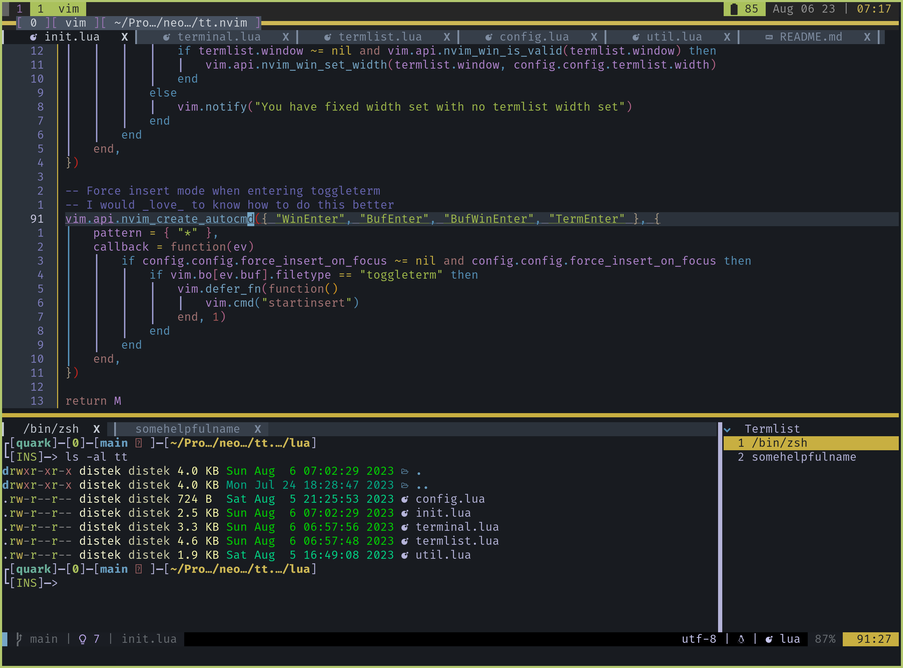

# tt.nvim

A little toggleterm with a terminal listing and clickable winbar tabs



## Installation

Via [lazy.nvim](https://github.com/folke/lazy.nvim):

```lua
    {
        "distek/tt.nvim",
        config = function()
            require("tt").setup({
                -- config
            })
        end
    },
```

## Default config

```lua
{
    termlist = {
        enabled = true,
        width = 25,
        name = "Terminals",
        winhighlight = "Normal:Normal", -- See :h winhighlight - You can change winbar colors as well
                                        -- (e.g. "Normal:Normal,WinBar:MyCoolWinBarHL")
        winbar = true, -- enable showing the winbar
        focus_on_select = true, -- <cr> on a list item will focus that terminal, not just display it
    },

    terminal = {
        winhighlight = "Normal:Normal",
        winbar = false,
        force_insert_on_focus = true, -- do our best to ensure terminal is always in insert mode when
                                      -- entering the terminal in whatever fashion
    },

    height = 15,

    fixed_height = false,
    fixed_width = true,

    pre_cb = nil, -- function|nil: pre-hook to run prior to opening the terminal
    post_cb = nil, -- function|nil: post-hook to run after opening the terminal
}
```

## Usage

The terminal has the filetype of `toggleterm`
The termlist has the filetype of `termlist`
Use the above for whatever autocmds you desire

An example configuration using lazy is located in [example](example/example-init.lua)

```lua
local t = require("tt")

-- Global functions:
t:IsOpen() -- bool: if terminal is open or not

-- Terminal specific functions:
t.terminal:NewTerminal(name: string, command: string) -- Open new terminal running command with name

t.terminal:Open("last"|idx: int) -- Open the "last" used terminal, or terminal at index "idx"
                                 -- Terminal's are tracked via t.terminal:TermList with
                                 -- t.terminal:TermListIdx being the current terminal's index

t.terminal:Toggle() -- Toggles the term

t.terminal:Close() -- Just closes the open toggle term window

t.terminal:Delete(idx: int) -- Closes the terminal at "idx". If it is the last terminal, closes the
                            -- window as well, otherwise it focuses the next terminal

t.terminal:FocusNext() -- Focus the next terminal
t.terminal:FocusPrevious() -- Focus the previous terminal


-- Termlist functions
t.termlist:UpdateTermList() -- Refreshes the current termlist (mostly just for t.terminal)

t.termlist:OpenTermUnderCursor() -- Opens the current term under cursor, optionally not focusing it based on
                                 -- what you have "focus_on_select" set to

t.termlist:RenameTermUnderCursor() -- Rename the terminal under cursor (uses vim.ui.input)

t.termlist:NewTerminal() -- create a new terminal

t.termlist:DeleteTermUnderCursor() -- remove the terminal under cursor

-- Default termlist mappings:
vim.api.nvim_buf_set_keymap(
    t.termlist.bufid,
    "n",
    "<cr>",
    '<cmd>lua require("tt.termlist"):OpenTermUnderCursor()<cr>',
    { noremap = true }
)
vim.api.nvim_buf_set_keymap(
    t.termlist.bufid,
    "n",
    "r",
    '<cmd>lua require("tt.termlist"):RenameTermUnderCursor()<cr>',
    { noremap = true }
)
vim.api.nvim_buf_set_keymap(
    t.termlist.bufid,
    "n",
    "n",
    '<cmd>lua require("tt.terminal"):NewTerminal()        <cr>',
    { noremap = true }
)
vim.api.nvim_buf_set_keymap(
    t.termlist.bufid,
    "n",
    "dd",
    '<cmd>lua require("tt.termlist"):DeleteTermUnderCursor()<cr>',
    { noremap = true }
)
```
